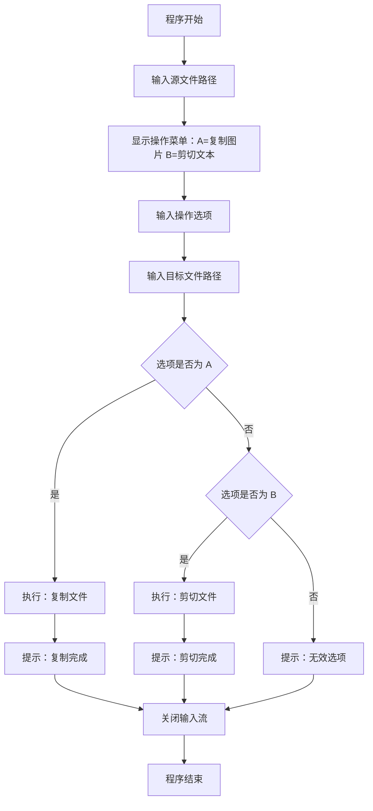

```mermaid
flowchart TD

Start[程序开始] --> InputSrc[输入源文件路径]
InputSrc --> Menu[显示操作菜单：A=复制图片 B=剪切文本]
Menu --> InputChoice[输入操作选项]
InputChoice --> InputDest[输入目标文件路径]

InputDest --> CheckA{选项是否为 A}
CheckA -->|是| DoCopy[执行：复制文件]
DoCopy --> CopyDone[提示：复制完成]

CheckA -->|否| CheckB{选项是否为 B}
CheckB -->|是| DoCut[执行：剪切文件]
DoCut --> CutDone[提示：剪切完成]

CheckB -->|否| Invalid[提示：无效选项]

CopyDone --> Close[关闭输入流]
CutDone --> Close
Invalid --> Close

Close --> End[程序结束]

```

