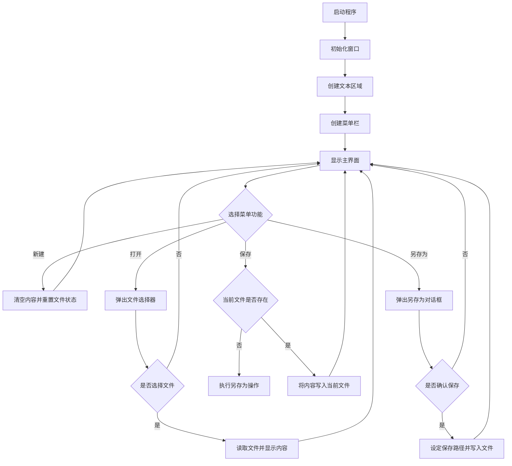

```mermaid
flowchart TD

    A[启动程序] --> B[初始化窗口]
    B --> C[创建文本区域]
    C --> D[创建菜单栏]
    D --> E[显示主界面]

    E --> F{选择菜单功能}

    %% 新建
    F -->|新建| G[清空内容并重置文件状态]

    %% 打开文件
    F -->|打开| H[弹出文件选择器]
    H --> I{是否选择文件}
    I -->|是| J[读取文件并显示内容]
    I -->|否| E

    %% 保存
    F -->|保存| K{当前文件是否存在}
    K -->|否| L[执行另存为操作]
    K -->|是| M[将内容写入当前文件]

    %% 另存为
    F -->|另存为| N[弹出另存为对话框]
    N --> O{是否确认保存}
    O -->|是| P[设定保存路径并写入文件]
    O -->|否| E

    G --> E
    J --> E
    M --> E
    P --> E

```

