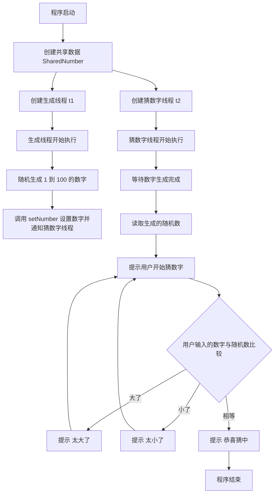

```mermaid
flowchart TD

    A[程序启动] --> B[创建共享数据 SharedNumber]
    B --> C[创建生成线程 t1]
    B --> D[创建猜数字线程 t2]

    C --> E[生成线程开始执行]
    E --> F[随机生成 1 到 100 的数字]
    F --> G[调用 setNumber 设置数字并通知猜数字线程]

    D --> H[猜数字线程开始执行]
    H --> I[等待数字生成完成]
    I --> J[读取生成的随机数]

    J --> K[提示用户开始猜数字]
    K --> L{用户输入的数字与随机数比较}

    L -->|大了| M[提示 太大了]
    L -->|小了| N[提示 太小了]
    L -->|相等| O[提示 恭喜猜中]

    M --> K
    N --> K
    O --> P[程序结束]

```

