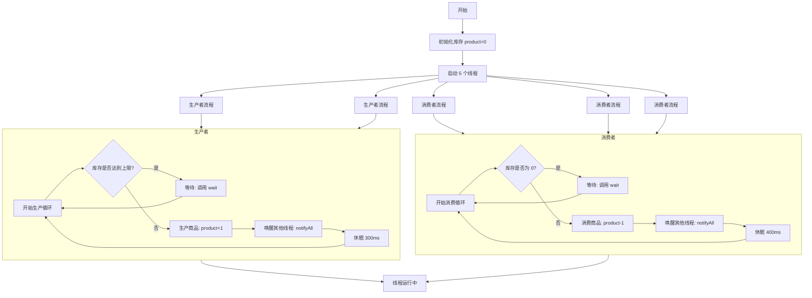

```mermaid
flowchart TD
    A[开始] --> B[初始化库存 product=0]
    B --> C[启动 5 个线程]

    C --> P1[生产者流程]
    C --> P2[生产者流程]
    C --> C1[消费者流程]
    C --> C2[消费者流程]
    C --> C3[消费者流程]

    %% 生产者流程
    subgraph Producer[生产者]
        Pstart[开始生产循环] --> Pcheck{库存是否达到上限?}
        Pcheck -- 是 --> Pwait[等待: 调用 wait]
        Pcheck -- 否 --> Pproduce[生产商品: product+1]
        Pproduce --> Pnotify[唤醒其他线程: notifyAll]
        Pnotify --> Psleep[休眠 300ms]
        Psleep --> Pstart
        Pwait --> Pstart
    end

    %% 消费者流程
    subgraph Consumer[消费者]
        Cstart[开始消费循环] --> Ccheck{库存是否为 0?}
        Ccheck -- 是 --> Cwait[等待: 调用 wait]
        Ccheck -- 否 --> Cconsume[消费商品: product-1]
        Cconsume --> Cnotify[唤醒其他线程: notifyAll]
        Cnotify --> Csleep[休眠 400ms]
        Csleep --> Cstart
        Cwait --> Cstart
    end

    P1 --> Producer
    P2 --> Producer
    C1 --> Consumer
    C2 --> Consumer
    C3 --> Consumer

    Producer --> End[线程运行中]
    Consumer --> End

```

