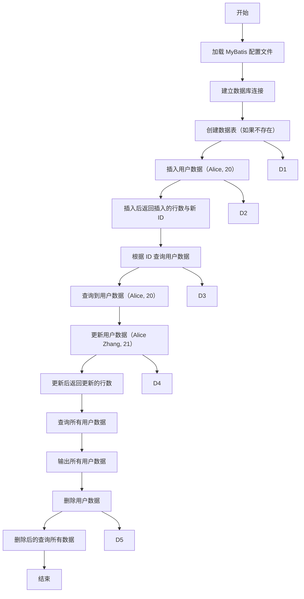

```mermaid
graph TD
    A[开始] --> B[加载 MyBatis 配置文件]
    B --> C[建立数据库连接]
    C --> D[创建数据表（如果不存在）]
    D --> E[插入用户数据（Alice, 20）]
    E --> F[插入后返回插入的行数与新 ID]
    F --> G[根据 ID 查询用户数据]
    G --> H[查询到用户数据（Alice, 20）]
    H --> I[更新用户数据（Alice Zhang, 21）]
    I --> J[更新后返回更新的行数]
    J --> K[查询所有用户数据]
    K --> L[输出所有用户数据]
    L --> M[删除用户数据]
    M --> N[删除后的查询所有数据]
    N --> O[结束]
    D --> D1
    E --> D2
    G --> D3
    I --> D4
    M --> D5

```

