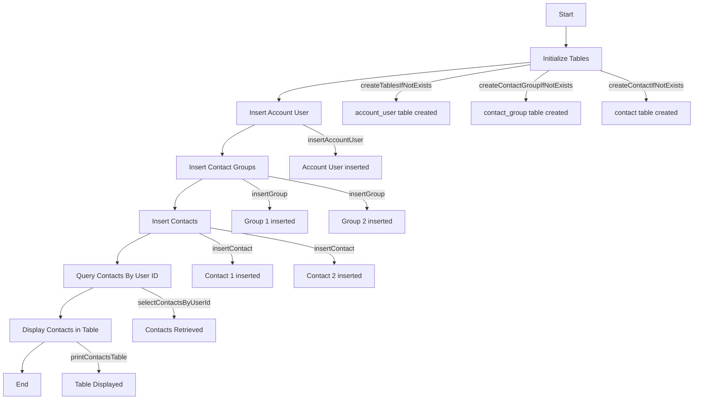

```mermaid
flowchart TD
    A[Start] --> B[Initialize Tables]
    B --> C[Insert Account User]
    C --> D[Insert Contact Groups]
    D --> E[Insert Contacts]
    E --> F[Query Contacts By User ID]
    F --> G[Display Contacts in Table]
    G --> H[End]

    B -->|createTablesIfNotExists| B1[account_user table created]
    B -->|createContactGroupIfNotExists| B2[contact_group table created]
    B -->|createContactIfNotExists| B3[contact table created]

    C -->|insertAccountUser| C1[Account User inserted]

    D -->|insertGroup| D1[Group 1 inserted]
    D -->|insertGroup| D2[Group 2 inserted]

    E -->|insertContact| E1[Contact 1 inserted]
    E -->|insertContact| E2[Contact 2 inserted]

    F -->|selectContactsByUserId| F1[Contacts Retrieved]

    G -->|printContactsTable| G1[Table Displayed]

```

