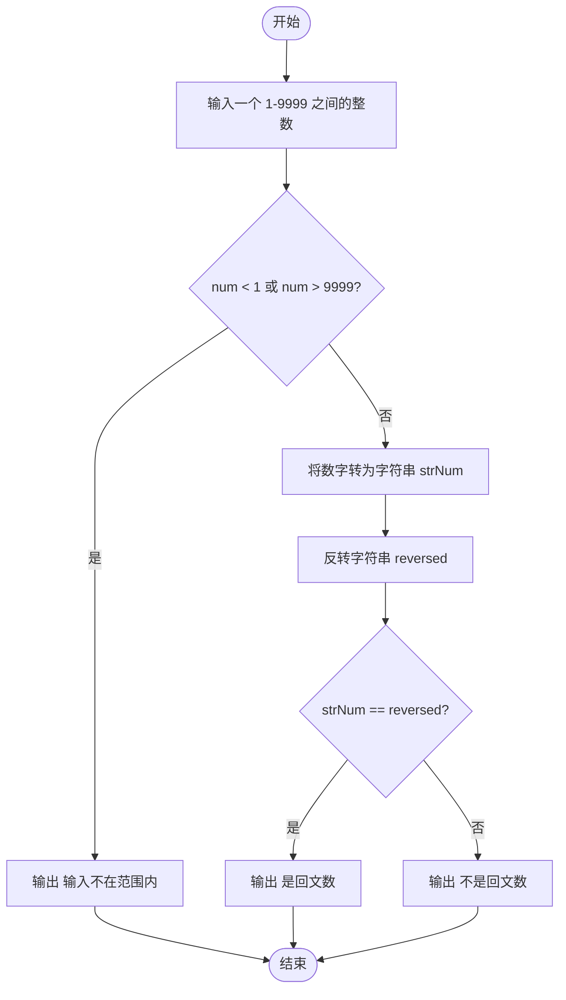
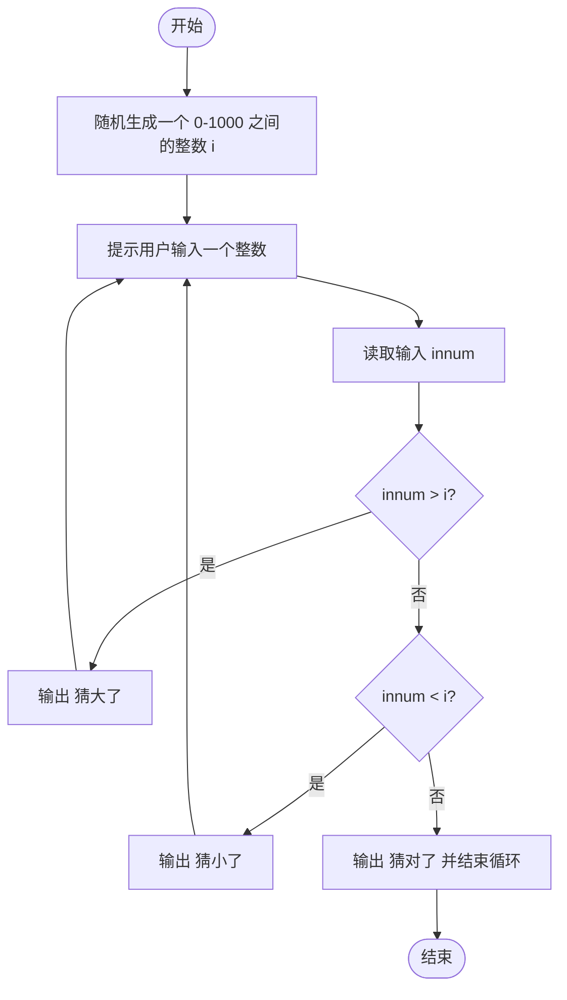

```mermaid
flowchart TD
    A([开始]) --> B[输入一个 1-9999 之间的整数]
    B --> C{num < 1 或 num > 9999?}
    C -->|是| D[输出 输入不在范围内]
    C -->|否| E[将数字转为字符串 strNum]
    E --> F[反转字符串 reversed]
    F --> G{strNum == reversed?}
    G -->|是| H[输出 是回文数]
    G -->|否| I[输出 不是回文数]
    D --> J([结束])
    H --> J
    I --> J

```

```mermaid
flowchart TD
    A([开始]) --> B[随机生成一个 0-1000 之间的整数 i]
    B --> C[提示用户输入一个整数]
    C --> D[读取输入 innum]
    D --> E{innum > i?}
    E -->|是| F[输出 猜大了]
    E -->|否| G{innum < i?}
    G -->|是| H[输出 猜小了]
    G -->|否| I[输出 猜对了 并结束循环]
    F --> C
    H --> C
    I --> J([结束])

```

