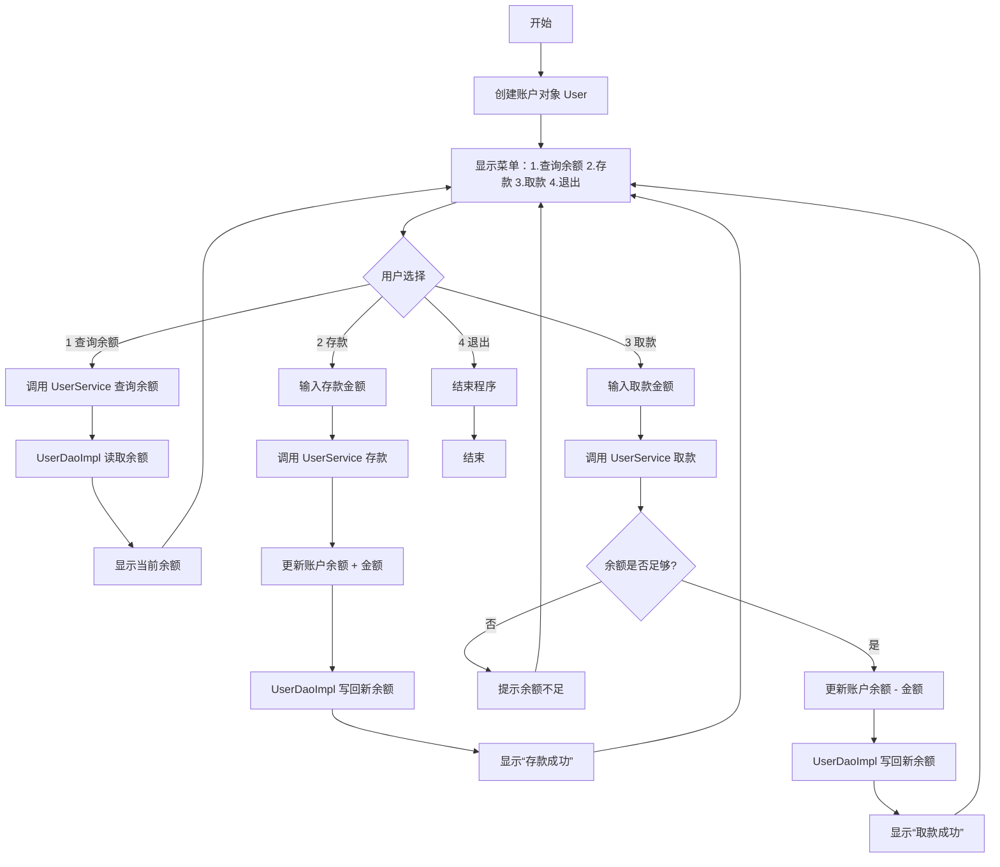

```mermaid
flowchart TD
    A[开始] --> B[创建账户对象 User]
    B --> C["显示菜单：1.查询余额 2.存款 3.取款 4.退出"]
    C --> D{用户选择}

    D -->|1 查询余额| E[调用 UserService 查询余额]
    E --> F[UserDaoImpl 读取余额]
    F --> G[显示当前余额]
    G --> C

    D -->|2 存款| H[输入存款金额]
    H --> I[调用 UserService 存款]
    I --> J[更新账户余额 + 金额]
    J --> K[UserDaoImpl 写回新余额]
    K --> L["显示“存款成功”"]
    L --> C

    D -->|3 取款| M[输入取款金额]
    M --> N[调用 UserService 取款]
    N --> O{余额是否足够?}
    O -->|否| P[提示余额不足]
    O -->|是| Q[更新账户余额 - 金额]
    Q --> R[UserDaoImpl 写回新余额]
    R --> S["显示“取款成功”"]
    P --> C
    S --> C

    D -->|4 退出| T[结束程序]
    T --> U[结束]
```

