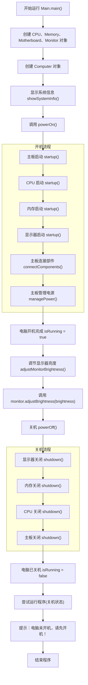

```mermaid
flowchart TD
    A["开始运行 Main.main()"] --> B["创建 CPU、Memory、Motherboard、Monitor 对象"]
    B --> C["创建 Computer 对象"]
    C --> D["显示系统信息 showSystemInfo()"]
    D --> E["调用 powerOn()"]
    
    subgraph 开机流程
        E1["主板启动 startup()"]
        E2["CPU 启动 startup()"]
        E3["内存启动 startup()"]
        E4["显示器启动 startup()"]
        E5["主板连接部件 connectComponents()"]
        E6["主板管理电源 managePower()"]
        E1 --> E2 --> E3 --> E4 --> E5 --> E6
    end
    E --> E1
    E6 --> F["电脑开机完成 isRunning = true"]

    F --> I["调节显示器亮度 adjustMonitorBrightness()"]
    I --> J["调用 monitor.adjustBrightness(brightness)"]
    J --> K["关机 powerOff()"]

    subgraph 关机流程
        K1["显示器关闭 shutdown()"]
        K2["内存关闭 shutdown()"]
        K3["CPU 关闭 shutdown()"]
        K4["主板关闭 shutdown()"]
        K1 --> K2 --> K3 --> K4
    end
    K --> K1
    K4 --> L["电脑已关机 isRunning = false"]

    L --> M["尝试运行程序(关机状态)"]
    M --> N["提示：电脑未开机，请先开机！"]
    N --> O["结束程序"]

```

