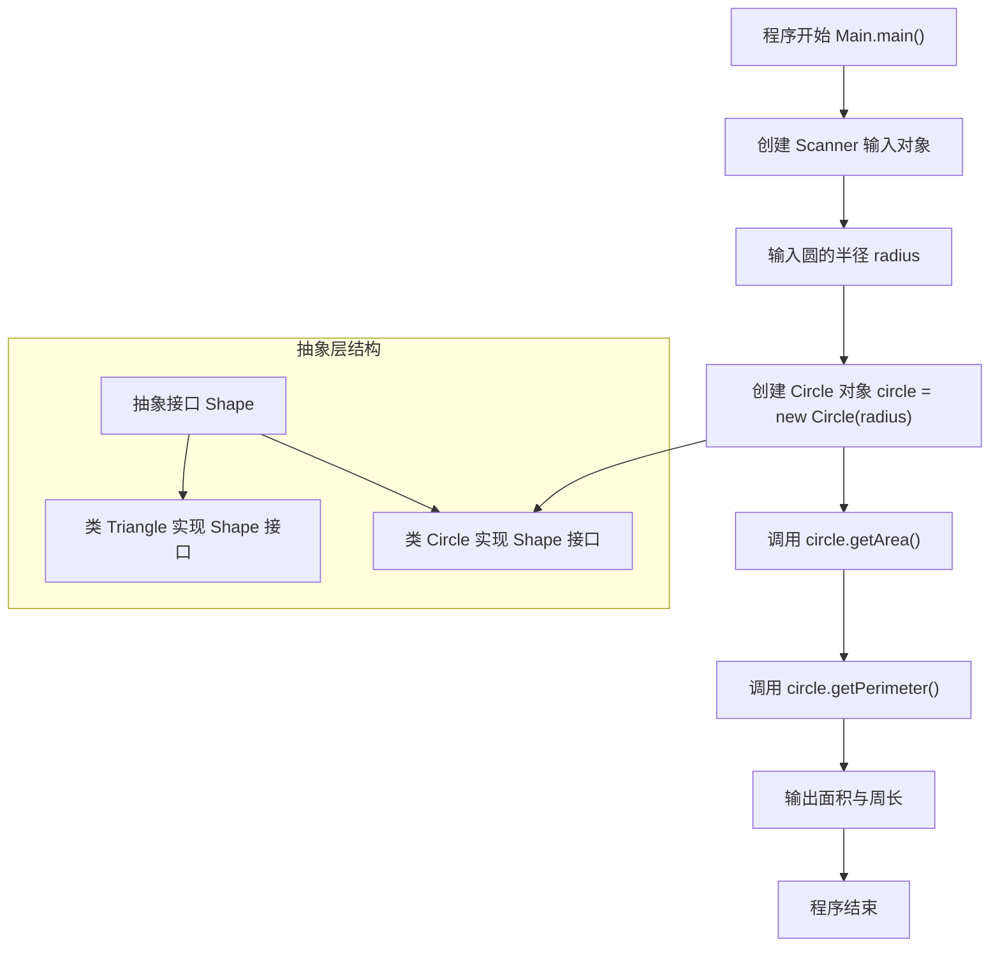

```mermaid
flowchart TD
    A["程序开始 Main.main()"] --> B["创建 Scanner 输入对象"]
    B --> C["输入圆的半径 radius"]
    C --> D["创建 Circle 对象 circle = new Circle(radius)"]
    D --> E["调用 circle.getArea()"]
    E --> F["调用 circle.getPerimeter()"]
    F --> G["输出面积与周长"]
    G --> H["程序结束"]

    %% 定义抽象层结构
    subgraph 抽象层结构
        S["抽象接口 Shape"]
        C1["类 Circle 实现 Shape 接口"]
        T1["类 Triangle 实现 Shape 接口"]
        S --> C1
        S --> T1
    end

    %% 连接主程序与抽象结构
    D --> C1

```

