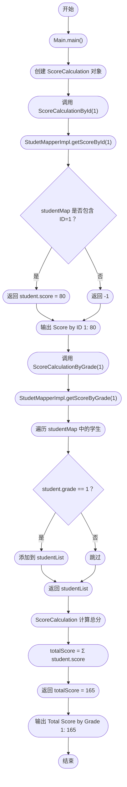

```mermaid
flowchart TD
    A(["开始"])
    B(["Main.main()"])
    C(["创建 ScoreCalculation 对象"])
    D(["调用 ScoreCalculationById(1)"])
    E(["StudetMapperImpl.getScoreById(1)"])
    F{"studentMap 是否包含 ID=1？"}
    G(["返回 student.score = 80"])
    H(["返回 -1"])
    I(["输出 Score by ID 1: 80"])
    J(["调用 ScoreCalculationByGrade(1)"])
    K(["StudetMapperImpl.getScoreByGrade(1)"])
    L(["遍历 studentMap 中的学生"])
    M{"student.grade == 1？"}
    N(["添加到 studentList"])
    O(["跳过"])
    P(["返回 studentList"])
    Q(["ScoreCalculation 计算总分"])
    R(["totalScore = Σ student.score"])
    S(["返回 totalScore = 165"])
    T(["输出 Total Score by Grade 1: 165"])
    U(["结束"])

    A --> B
    B --> C
    C --> D
    D --> E
    E --> F
    F -- 是 --> G
    F -- 否 --> H
    G --> I
    H --> I
    I --> J
    J --> K
    K --> L
    L --> M
    M -- 是 --> N
    M -- 否 --> O
    N --> P
    O --> P
    P --> Q
    Q --> R
    R --> S
    S --> T
    T --> U

```

