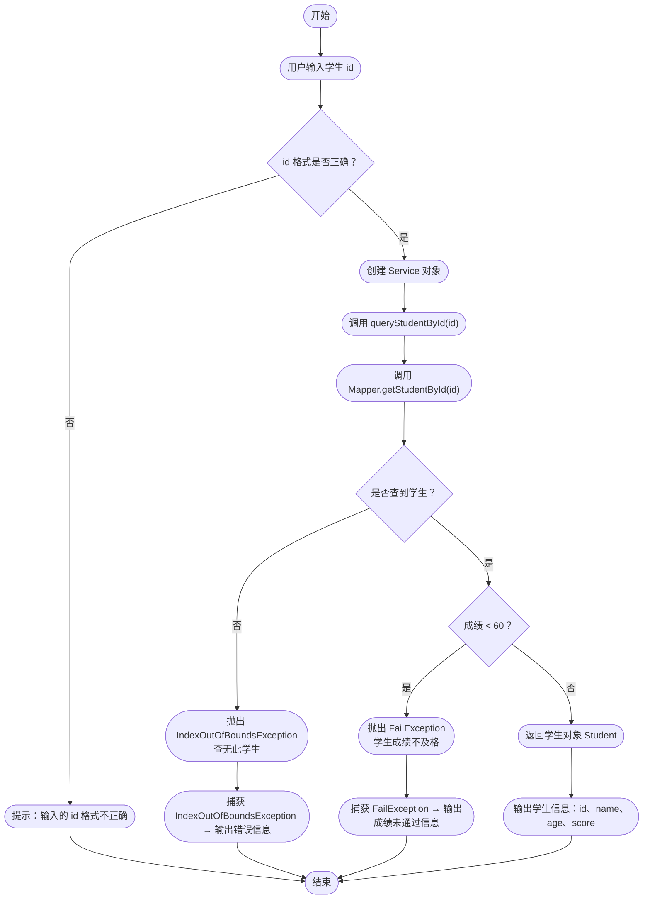

```mermaid
flowchart TD
    A(["开始"])
    B(["用户输入学生 id"])
    C{"id 格式是否正确？"}
    D(["提示：输入的 id 格式不正确"])
    E(["创建 Service 对象"])
    F(["调用 queryStudentById(id)"])
    G(["调用 Mapper.getStudentById(id)"])
    H{"是否查到学生？"}
    I(["抛出 IndexOutOfBoundsException<br/>查无此学生"])
    J{"成绩 < 60？"}
    K(["抛出 FailException<br/>学生成绩不及格"])
    L(["返回学生对象 Student"])
    M(["输出学生信息：id、name、age、score"])
    N(["捕获 IndexOutOfBoundsException → 输出错误信息"])
    O(["捕获 FailException → 输出成绩未通过信息"])
    P(["结束"])

    %% 流程连接
    A --> B
    B --> C
    C -- 否 --> D --> P
    C -- 是 --> E
    E --> F
    F --> G
    G --> H
    H -- 否 --> I --> N --> P
    H -- 是 --> J
    J -- 是 --> K --> O --> P
    J -- 否 --> L --> M --> P

```

