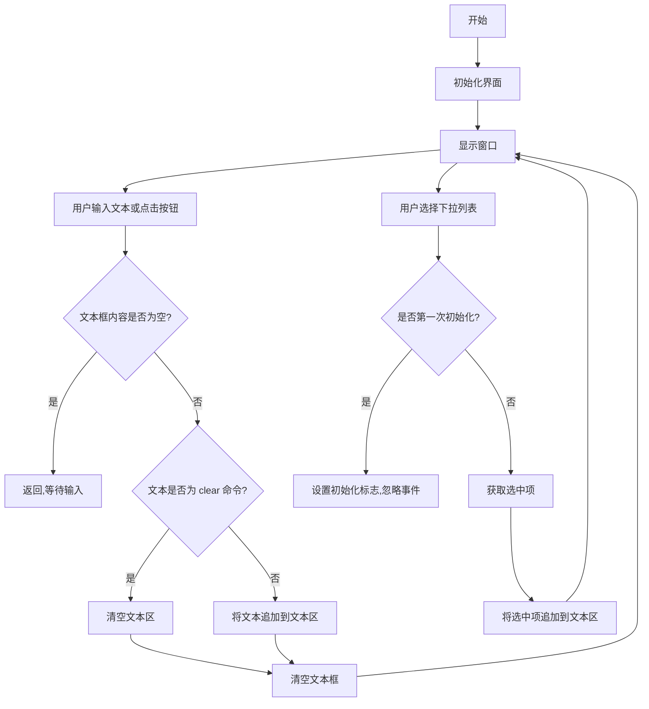

```mermaid
flowchart TD
    A[开始] --> B[初始化界面]
    B --> C[显示窗口]

    %% 文本框 / 按钮事件
    C --> D[用户输入文本或点击按钮]
    D --> E{文本框内容是否为空?}
    E -- 是 --> F[返回,等待输入]
    E -- 否 --> G{文本是否为 clear 命令?}
    G -- 是 --> H[清空文本区]
    G -- 否 --> I[将文本追加到文本区]
    H --> J[清空文本框]
    I --> J
    J --> C

    %% 下拉框事件
    C --> K[用户选择下拉列表]
    K --> L{是否第一次初始化?}
    L -- 是 --> M[设置初始化标志,忽略事件]
    L -- 否 --> N[获取选中项]
    N --> O[将选中项追加到文本区]
    O --> C

```

